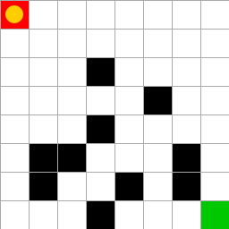

# Simple Gridworld Gymnasium Environment

SimpleGrid is a super simple grid environment for [Gymnasium](https://gymnasium.farama.org/). It is easy to use and customise and it is intended to offer an environment for quickly testing and prototyping different RL algorithms.

It is also efficient, lightweight and has few dependencies (gymnasium, numpy, matplotlib). 



SimpleGrid involves navigating a grid from a Start (red tile) to a Goal (green tile) state without colliding with any Wall (black tiles) by walking over the Empty (white tiles) cells. The yellow circle denotes the agent's current position. 


## Installation

To install SimpleGrid, you can either use pip

```bash
pip install gym-simplegrid
```

or you can clone the repository and run an editable installation

```bash
git clone https://github.com/damat-le/gym-simplegrid.git
cd gym-simplegrid
pip install -e .
```


## Citation

Please use this bibtex if you want to cite this repository in your publications:

```tex
@misc{gym_simplegrid,
  author = {Leo D'Amato},
  title = {Simple Gridworld Environment for OpenAI Gym},
  year = {2022},
  publisher = {GitHub},
  journal = {GitHub repository},
  howpublished = {\url{https://github.com/damat-le/gym-simplegrid}},
}
```

## Getting Started

Basic usage options:

```python
import gymnasium as gym
import gym_simplegrid

# Load the default 8x8 map
env = gym.make('SimpleGrid-8x8-v0', render_mode='human')

# Load the default 4x4 map
env = gym.make('SimpleGrid-4x4-v0', render_mode='human')

# Load a custom map
obstacle_map = [
        "10001000",
        "10010000",
        "00000001",
        "01000001",
    ]

env = gym.make(
    'SimpleGrid-v0', 
    obstacle_map=obstacle_map, 
    render_mode='human'
)

# Use the options dict in the reset method
# This initialises the agent in location (0,0) and the goal in location (7,7)
env = gym.make('SimpleGrid-8x8-v0', render_mode='human')
obs, info = env.reset(options={'start_loc':0, 'goal_loc':63})
```

Basic example with rendering:

```python
import gymnasium as gym
import gym_simplegrid

env = gym.make('SimpleGrid-8x8-v0', render_mode='human')
obs, info = env.reset()
done = env.unwrapped.done

for _ in range(50):
    if done:
        break
    action = env.action_space.sample()
    obs, reward, done, _, info = env.step(action)
env.close()
```

For an other example, take a look at the [example script](example.py).


## Environment Description

### Action Space

The action space is `gymnasium.spaces.Discrete(4)`. An action is a `int` number and represents a direction according to the following scheme:

- 0: UP
- 1: DOWN
- 2: LEFT
- 3: RIGHT

### Observation Space

Assume to have an environment of size `(nrow, ncol)`, then the observation space is `gymnasium.spaces.Discrete(nrow * ncol)`. Hence, an observation is an integer from `0` to `nrow * ncol - 1` and represents the agent's current position. We can convert an observation `s` to a tuple `(x,y)` using the following formulae:

```python
 x = s // ncol # integer division
 y = s % ncol  # modulo operation
```

For example: let `nrow=4`, `ncol=5` and let `s=11`. Then `x=11//5=2` and `y=10%5=1`.

Viceversa, we can convert a tuple `(x,y)` to an observation `s` using the following formulae:

```python
s = x * ncol + y
```

For example: let `nrow=4`, `ncol=5` and let `x=2`, `y=1`. Then `s=2*5+1=11`.

### Environment Dynamics

In the current implementation, the episodes terminates only when the agent reaches the goal state. In case the agent takes a non-valid action (e.g. it tries to walk over a wall or exit the grid), the agent stays in the same position and receives a negative reward.

It is possible to subclass the `SimpleGridEnv` class  and to override the `step()` method to define custom dynamics (e.g. truncate the episode if the agent takes a non-valid action).

### Rewards

Currently, the reward map is defined in the `get_reward()` method of the `SimpleGridEnv` class.

For a given position `(x,y)`, the default reward function is defined as follows:

```python 
def get_reward(self, x: int, y: int) -> float:
    """
    Get the reward of a given cell.
    """
    if not self.is_in_bounds(x, y):
        # if the agent tries to exit the grid, it receives a negative reward
        return -1.0
    elif not self.is_free(x, y):
        # if the agent tries to walk over a wall, it receives a negative reward
        return -1.0
    elif (x, y) == self.goal_xy:
        # if the agent reaches the goal, it receives a positive reward
        return 1.0
    else:
        # otherwise, it receives no reward
        return 0.0
```

It is possible to subclass the `SimpleGridEnv` class  and to override this method to define custom rewards.

## Notes on rendering

The default frame rate is 8 FPS. It is possible to change it through the `metadata` dictionary. 

To properly render the environment, remember that the point (x,y) in the desc matrix corresponds to the point (y,x) in the rendered matrix.
This is because the rendering code works in terms of width and height while the computation in the environment is done using x and y coordinates.
You don't have to worry about this unless you play with the environment's internals.
