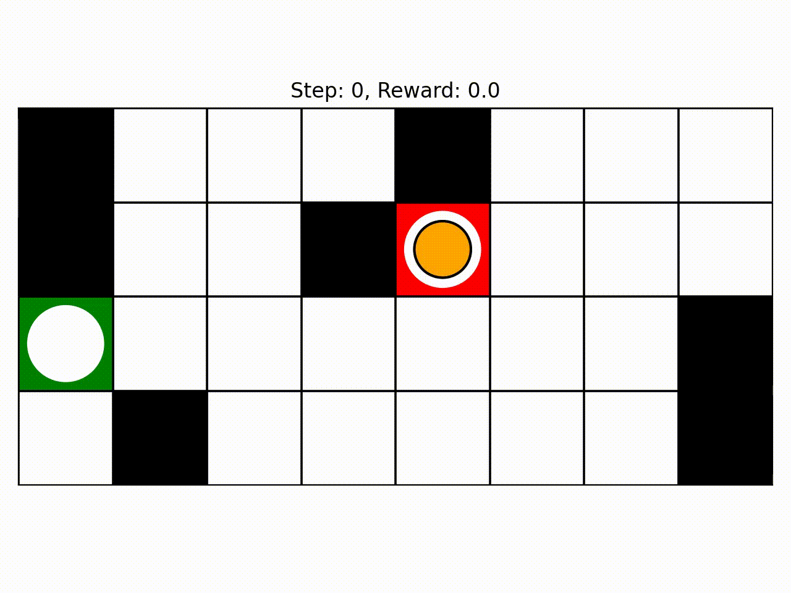
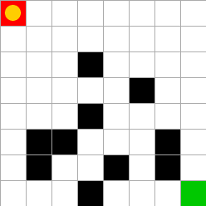

<a href="https://paypal.me/dmtleo?country.x=IT&locale.x=it_IT" target="_blank">
<p align=right>
    
</p>
</a>

# SimpleGrid: Simple Grid Environment for Gymnasium

SimpleGrid is a super simple grid environment for [Gymnasium](https://gymnasium.farama.org/) (formerly OpenAI gym). It is easy to use and customise and it is intended to offer an environment for quickly testing and prototyping different Reinforcement Learning algorithms.

It is also efficient, lightweight and has few dependencies (gymnasium, numpy, matplotlib). 

<p align="center">
    
</p>

<!--  -->

SimpleGrid involves navigating a grid from a Start (red tile) to a Goal (green tile) state without colliding with any Wall (black tiles) by walking over the Empty (white tiles) cells. The yellow circle denotes the agent's current position. 

### Key Features
- **Gymnasium v0.26+ Ready**: Supports the `terminated`, `truncated` API and proper seeding.
- **Decoupled Architecture**: Logic, Rendering, and Map Parsing are handled by specialized classes.
- **High Performance**: Vectorized map parsing and coordinate logic using NumPy.
- **Minimal Dependencies**: Only `gymnasium`, `numpy`, and `matplotlib`.

## Installation

Install via pip:
```bash
pip install gym-simplegrid
```

Or for development (editable install):
```bash
git clone https://github.com/damat-le/gym-simplegrid.git
cd gym-simplegrid
pip install -e .
```

## Getting Started

### Basic Usage
```python
import gymnasium as gym
import gym_simplegrid

# Define custom map (optional)
obstacle_map = [
    "00001",
    "00100",
    "00010",
]

# Create environment using the custom map
# Note: there are also pre-registered maps like 'SimpleGrid-4x4-v0', 'SimpleGrid-8x8-v0', etc.
env = gym.make(
    'SimpleGrid-v0', 
    obstacle_map=obstacle_map, 
    render_mode='human'
)


# Reset with options
# options can specify 'start_loc' and 'goal_loc' as int or (row, col)
obs, info = env.reset(
    seed=42, 
    options={'start_loc': 0, 'goal_loc': (2, 4)}
)

# Action-Perception Loop
for _ in range(50):
    action = env.action_space.sample() 
    
    # Gymnasium returns 5 values
    obs, reward, terminated, truncated, info = env.step(action)
    
    # Manual render call (allows for better performance control)
    env.render()

    if terminated or truncated:
        break

env.close()
```

## Environment Description

### Action Space

The action space is `gymnasium.spaces.Discrete(4)`. An action is a `int` number and represents a direction according to the following scheme:

- 0: UP
- 1: DOWN
- 2: LEFT
- 3: RIGHT

### Observation Space

Assume to have an environment of size `(nrow, ncol)`, then the observation space is `gymnasium.spaces.Discrete(nrow * ncol)`. Hence, an observation is an integer from `0` to `nrow * ncol - 1` and represents the agent's current position. We can convert an observation `s` to a tuple `(x,y)` using the following formulae:

```python
 x = s // ncol # integer division
 y = s % ncol  # modulo operation
```

For example: let `nrow=4`, `ncol=5` and let `s=11`. Then `x=11//5=2` and `y=11%5=1`.

Viceversa, we can convert a tuple `(x,y)` to an observation `s` using the following formulae:

```python
s = x * ncol + y
```

For example: let `nrow=4`, `ncol=5` and let `x=2`, `y=1`. Then `s=2*5+1=11`.

### Environment Dynamics

In the current implementation, the episodes terminates only when the agent reaches the goal state or it is truncated if the maximum number of steps (when provided) is exceeded. In case the agent takes a non-valid action (e.g. it tries to walk over a wall or exit the grid), the agent stays in the same position and receives a negative reward.

It is possible to subclass the `SimpleGridEnv` class  and to override the `step()` method to define custom dynamics (e.g. truncate the episode if the agent takes a non-valid action).

### Rewards

Currently, the reward map is defined in the `get_reward()` method of the `SimpleGridEnv` class.

For a given position `(x,y)`, the default reward function is defined as follows:

```python 
def get_reward(
        self, 
        xy: tuple[int, int], 
) -> float:
    """
    Logic for reward calculation. Overload this to change behavior.
    """
    if not self._is_valid_xy(xy):
        return -1.0         # Penalty for invalid move
    if xy == self.goal_xy:
        return 1.0          # Reward for reaching the goal
    return -0.1             # Step penalty to encourage shorter paths
```
It is possible to subclass the `SimpleGridEnv` class and to override this method to define custom rewards.

## Notes on Rendering
- **Passive Rendering**: The environment does not render automatically inside `step()`. You must call `env.render()` explicitly. This improves training speed significantly when rendering is not needed.
- **Modes**: 
    - `human`: Live Matplotlib window.
    - `rgb_array`: Returns a NumPy array of pixels.
    - `ansi`: Returns a CSV-style string of the current state.

## Citation
```tex
@misc{gym_simplegrid,
  author = {Leo D'Amato},
  title = {SimpleGrid: Simple Grid Environment for Gymnasium},
  year = {2022},
  publisher = {GitHub},
  journal = {GitHub repository},
  howpublished = {\url{https://github.com/damat-le/gym-simplegrid}},
}
```