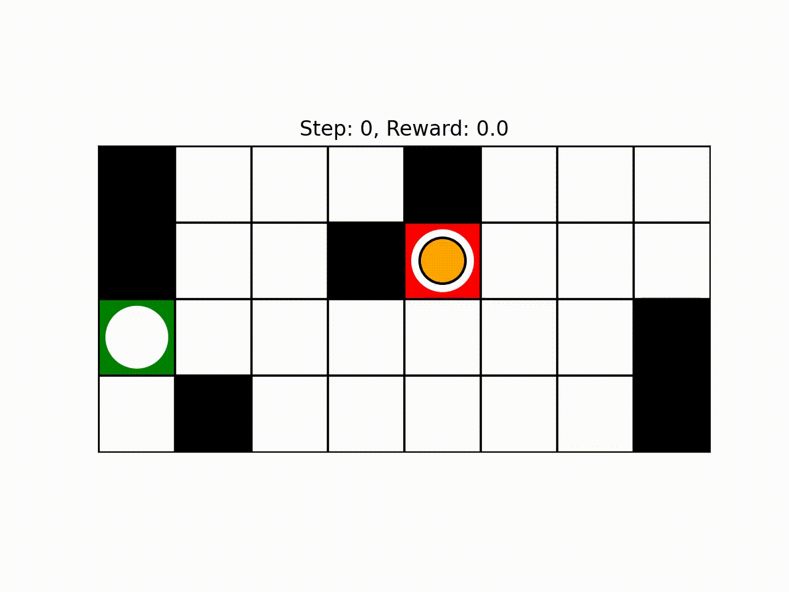

# Simple Gridworld Environment for OpenAI Gym

SimpleGrid is a super simple gridworld environment for [Gymnasium](https://gymnasium.farama.org/). It is easy to use and customise and it is intended to offer an environment for quick testing and prototyping different RL algorithms.

It is also efficient, lightweight and has few dependencies (gymnasium, numpy, matplotlib). 



SimpleGrid involves navigating a grid from Start(S) (red tile) to Goal(G) (green tile) without colliding with any Wall(W) (black tiles) by walking over
the Empty(E) (white tiles) cells. The yellow circle denotes the agent's current position. 


## Installation

To install SimpleGrid, you can either use pip

```bash
pip install gym-simplegrid
```

or you can clone the repository and run an editable installation

```bash
git clone https://github.com/damat-le/gym-simplegrid.git
cd gym-simplegrid
pip install -e .
```


## Citation

Please use this bibtex if you want to cite this repository in your publications:

```tex
@misc{gym_simplegrid,
  author = {Leo D'Amato},
  title = {Simple Gridworld Environment for OpenAI Gym},
  year = {2022},
  publisher = {GitHub},
  journal = {GitHub repository},
  howpublished = {\url{https://github.com/damat-le/gym-simplegrid}},
}
```

## Getting Started

Basic usage options:

```python
import gymnasium
import gym_simplegrid

# Load the default 8x8 map
env = gym.make('SimpleGrid-8x8-v0', render_mode='human')

# Load the default 4x4 map
env = gym.make('SimpleGrid-4x4-v0', render_mode='human')

# Load a custom map
obstacle_map = [
        "10001000",
        "10010000",
        "00000001",
        "01000001",
    ]

env = gym.make(
    'SimpleGrid-v0', 
    obstacle_map=obstacle_map, 
    render_mode='human'
)

# Set custom rewards
Subclass SimpleGridEnv and override the get_reward() method
```

Basic example with rendering:

```python
import gymnasium
import gym_simplegrid

env = gym.make('SimpleGrid-8x8-v0', render_mode='human')
obs, info = env.reset()
done = env.unwrapped.done

for _ in range(50):
    if done:
        obs, info = env.reset()
    action = env.action_space.sample()
    obs, reward, done, _, info = env.step(action)
env.close()
```

For an other example, take a look at the [example script](example.py).


## Environment Description

### Action Space

The action space is `gym.spaces.Discrete(4)`. An action is a `int` number and represents a direction according to the following scheme:

- 0: UP
- 1: DOWN
- 2: LEFT
- 3: RIGHT

### Observation Space

The observation is a tuple (x,y) representing the agent's current position.
The number of possible observations is dependent on the size of the map.
For example, the 4x4 map has 16 possible observations. 
The observation space is encoded as 

```python
gymnasium.spaces.Box(
    low=np.array([0, 0], dtype=int), 
    high=np.array([nrow, ncol], dtype=int) - 1
)
```
where `nrow` and `ncol` are the number of rows and columns of the map respectively.

### Rewards

Currently, the reward map is defined in the get_reward() method of the SimpleGridEnv class.

It is possible to override this method to define custom rewards.

For a given position (x,y), the default reward is defined as follows:

```python 
def get_reward(self, x: int, y: int) -> float:
    """
    Get the reward of a given cell.
    """
    if not self.is_in_bounds(x, y):
        return -1.0
    elif not self.is_free(x, y):
        return -1.0
    elif (x, y) == self.goal_xy:
        return 1.0
    else:
        return 0.0
```

## Notes on rendering

The default frame rate is 5 FPS. It is possible to change it through the `metadata` dictionary. 

To properly render the environment, remember that the point (x,y) in the desc matrix corresponds to the point (y,x) in the rendered matrix.
This is because the rendering code works in terms of width and height while the computation in the environment is done using x and y coordinates.
You don't have to worry about this unless you play with the environment's internals.
